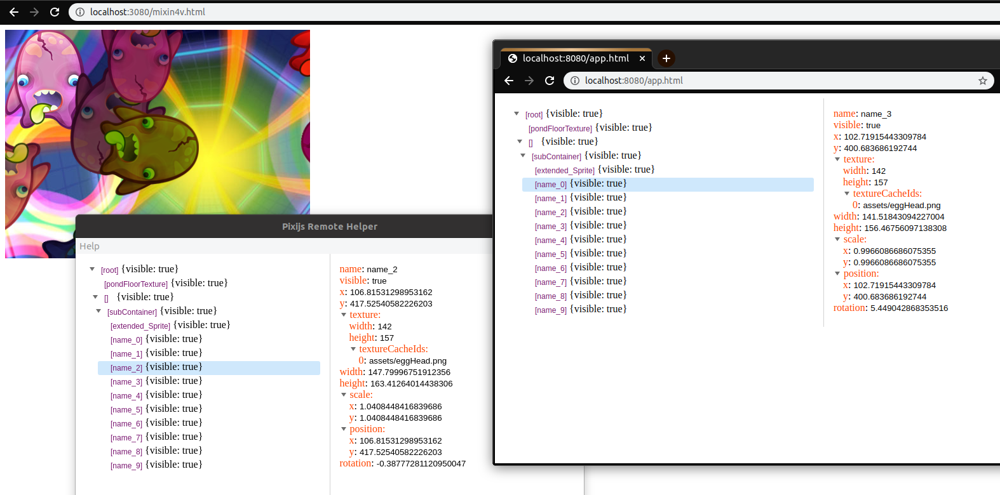

# Pixijs remote helper

Tools for remote inspecting pixijs application





# How use

**First time need do:**

1. *Install ways*:
 - Install from npm
```bush
npm install -g pixijs-remote-helper
```
  - Clone this repository
```bush
$cd ./pixijs-remote-helper
$npm run build
$npm i -g ../pixijs-remote-helper
```

2. Add mixin(./mixin build/main.bundle.js) script to pixijs app page where need debugging

3. Run app from terminal 
```
$pixihelper
```

4. Then open client page on http://localhost:3000/main.html for debuggin

## Options:

### You can change __CLIENT PORT__ page:
By default it is 3000 port
```bush
$POSRT=8080 pixihelper // then open client page on http://localhost:8080/main.html address
```

### Also you can change __SOCKET PORT__: 
By default it is 3010:

1. Run *server sockets* on new port
```bush
$SOCKET_PORT=3090 pixihelper
```

2. Connect mixin on new socket port
before add *mixin script* on page define __PIXI_HELPER_PROXY_HOST='http://localhost:3090'__ then add mixin script on page. __OR__ define in __localStorage__ 'pixiHelperProxyHost' variable then reload page with mixin

**For example: you can to run mixin example client use**
```bush
$npm run mixin:dev
```
Then open http://localhost:3080/mixin.html page with pixijs app

# For development start web application

You must have installed node.js then, clone this repo and next:

    npm i

    // run example pixi.js app
    npm run mixin:dev 

    // run application
    npm run web:dev

    // run middle server
    npm run server:dev


Then open http://localhost:8080/app.html for open web client
and open http://localhost:3080/mixin4v.html or http://localhost:3080/mixin5v.html  for open mixin examle.

# For development start electron application

You must have installed node.js then, clone this repo and next:

    npm i

    // run example pixi.js app
    npm run mixin:dev 

    // run application
    npm run app:dev


Then open http://localhost:8080/main.html for open client
and open http://localhost:3080/mixin4v.html or http://localhost:3080/mixin5v.html  for open mixin examle.
